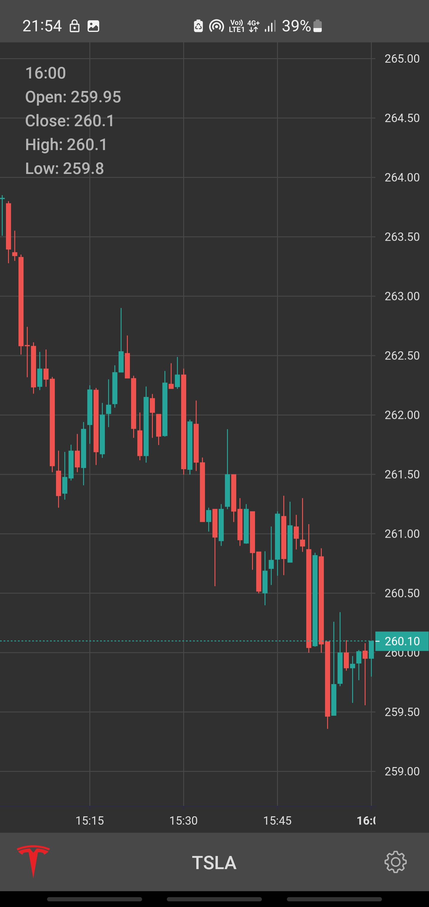

<h1 align="center">Stocks Viewer</h1>

  
  

  
Stocks Viewer is a sample Stocks app built for searching USA stocks.

 

  
### Architecture
  * MVVM (Model - View - ViewModel)
  * Single Activity

### Technology Stack
  * [Kotlin](https://kotlinlang.org/)
  * [Coroutines](https://github.com/Kotlin/kotlinx.coroutines)
  * [Android Jetpack](https://developer.android.com/jetpack)
    * [LiveData](https://developer.android.com/topic/libraries/architecture/livedata)
    * [Lifecycle](https://developer.android.com/topic/libraries/architecture/lifecycle)
    * [ViewModel](https://developer.android.com/topic/libraries/architecture/viewmodel)
	* [ConstraintLayout](https://developer.android.com/training/constraint-layout)
	* [Architecture Components](https://developer.android.com/topic/libraries/architecture)
    * [Navigation](https://developer.android.com/guide/navigation)
    * [WorkManager](https://developer.android.com/topic/libraries/architecture/workmanager)
    * [Room](https://developer.android.com/topic/libraries/architecture/room)
  * [Retrofit 2](https://square.github.io/retrofit/)
  * [GSON](https://github.com/google/gson)
  * [Material-Components](https://github.com/material-components/material-components-android)
  * [LightWeightCharts](https://tradingview.github.io/lightweight-charts/)
  * [Glide](https://bumptech.github.io/glide/)
  * [Shimmer](https://facebook.github.io/shimmer-android/)
  * [Lottie](https://airbnb.io/lottie/#/)
  
### App build with [Financial Modeling Prep API](https://site.financialmodelingprep.com/developer/docs/)